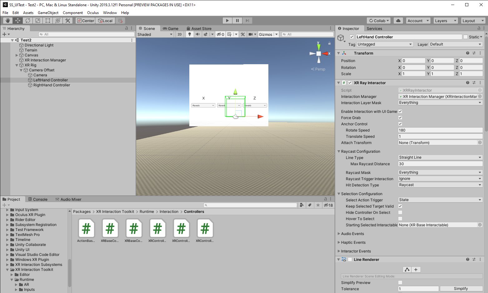

# Engineering Notebook 
## Week 3/27 – 4/2

### Weekly Activities and Progress
* We met as a group in the EPDC in the SEC with the VR equipment and worked together.
* We were able to implement some UI features: https://docs.google.com/document/d/17nC-1IX5XgXEFLIAQFK3fh-JOitAIdDzWz8Ecg8A0OI/edit
* We also mapped multiple audio parameter selections to x,y,z positional coordinates of the right hand. Included functions: normalization of positional data to 0 to 1, logarithmic scaling, and linear scaling with offset.
* We planned out some points to include on our Final Presentation Poster: https://docs.google.com/document/d/1iN7GPqWvH_HXgRferQT7vSzaFKxCQhZD-3u_vuZpSpo/edit

While implementing the UI we ran into some obstacles. Our goal for the UI was a World-space canvas in the scene that the user could use raycasting to select from drop-downs on. In a mockup file, we achieved this functionality by relying on the OVR (Oculus platform specific) raycasting logic to interact with the other implemented elements - however in our project file, the VR rig object is not platform-specific, so we are unable to use the Oculus SDK's assets. Due to this issue, we have to spend a little bit more time tweaking a work-around that uses a raycasting script from a different package to shoot a Ray out of the VR hand controller that acts as a means of user input and selection.

Photo of UI:

### Next Steps
* Polish UI and make sure the audio mappings work with UI selectors
* Finish Final Presentation Poster
* Create Test Surveys mentioned in testing plan
